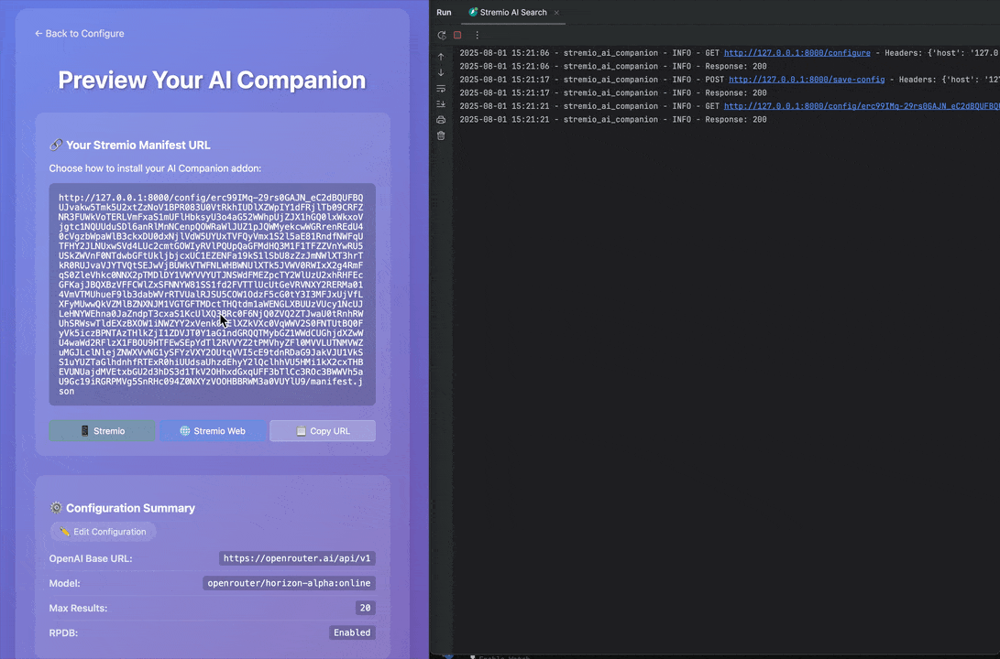

# Stremio AI Companion

🎬 **Your AI-powered movie discovery companion for Stremio** - Find the perfect movies to watch with intelligent recommendations and curated collections (coming soon).



## ✨ Features

- **AI Movie Discovery**: Find movies using natural language - "sci-fi movies about time travel" or "feel-good comedies from the 90s"
- **Smart Recommendations**: AI understands context and mood to suggest perfect matches
- **Rich Movie Data**: Complete information from TMDB with optional enhanced artwork from RPDB
- **Performance**: Normal requests (without caching) typically complete in just 5-6 seconds, providing quick and responsive movie discovery ⚡
- **Curated Collections**: AI-generated movie collections based on themes, moods, and genres (coming soon)
- **Privacy First**: No database required - your preferences encrypted in shareable URLs
- **Seamless Integration**: Works natively within Stremio as a catalog addon

## 🚀 Quick Start

### 1. Install Dependencies

```bash
pip install -r requirements.txt
```

### 2. Get API Keys

- **OpenAI API Key**: Get from [OpenAI Platform](https://platform.openai.com/account/api-keys)
- **TMDB API Key**: Get from [TMDB API Documentation](https://developer.themoviedb.org/docs) (register for an API key from your account settings)
- **RPDB API Key** (optional): Get from [RatingPosterDB](https://ratingposterdb.com/)

### 3. Run the Server

```bash
python main.py
```

Or with uvicorn:

```bash
uvicorn main:app --host 0.0.0.0 --port 8000
```

### 4. Configure Your AI Companion

1. Open http://localhost:8000 in your browser
2. Click "Configure Your AI Companion"
3. Enter your API keys and preferences
4. Copy the generated manifest URL
5. Add the manifest URL to Stremio as a new addon

### 🔄 Reconfiguring Your Addon

To edit an existing configuration:

1. **From Homepage**: Paste your manifest URL in the "Already have a config?" section
2. **From Preview Page**: Click the "✏️ Edit Configuration" button
3. **Direct URL**: Visit `/reconfigure?config=YOUR_ENCRYPTED_CONFIG`

Your existing settings will be pre-filled in the form for easy editing.

## 🏗️ Architecture

```
┌─────────────────┐    ┌──────────────┐    ┌─────────────┐
│   Stremio App   │───▶│  FastAPI     │───▶│   OpenAI    │
│                 │    │  Server      │    │   LLM API   │
└─────────────────┘    └──────────────┘    └─────────────┘
                              │
                              ▼
                       ┌──────────────┐    ┌─────────────┐
                       │   Parallel   │───▶│   TMDB API  │
                       │   Fetching   │    │             │
                       └──────────────┘    └─────────────┘
                              │
                              ▼
                       ┌──────────────┐    ┌─────────────┐
                       │   Optional   │───▶│    RPDB     │
                       │   Artwork    │    │   API       │
                       └──────────────┘    └─────────────┘
```

## 🛠️ API Endpoints

- `GET /` - Homepage with project description
- `GET /configure` - Configuration form interface
- `GET /configure?config=...` - Edit existing encrypted configuration (pre-filled form)
- `POST /save-config` - Save and encrypt configuration
- `GET /config/{config}/preview` - Preview addon configuration
- `GET /config/{config}/manifest.json` - Stremio manifest endpoint (combined movies + series)
- `GET /config/{config}/movie/manifest.json` - Dedicated movies-only manifest endpoint
- `GET /config/{config}/series/manifest.json` - Dedicated series-only manifest endpoint
- `GET /config/{config}/catalog/movie/{catalog_id}.json` - Movie catalog endpoint (combined addon)
- `GET /config/{config}/catalog/movie/{catalog_id}/search={search}.json` - Movie catalog search endpoint (combined addon)
- `GET /config/{config}/catalog/series/{catalog_id}.json` - Series catalog endpoint (combined addon)
- `GET /config/{config}/catalog/series/{catalog_id}/search={search}.json` - Series catalog search endpoint (combined addon)
- `GET /config/{config}/movie/catalog/movie/{catalog_id}.json` - Movie catalog endpoint (movies-only addon)
- `GET /config/{config}/movie/catalog/movie/{catalog_id}/search={search}.json` - Movie catalog search endpoint (movies-only addon)
- `GET /config/{config}/series/catalog/series/{catalog_id}.json` - Series catalog endpoint (series-only addon)
- `GET /config/{config}/series/catalog/series/{catalog_id}/search={search}.json` - Series catalog search endpoint (series-only addon)
- `GET /config/{config}` - Redirect to configure page with existing config

## 🎭 Split Manifest Support (v0.2.0+)

You can now install separate addons for movies and series, or use the combined addon:

### Installation Options

1. **Combined Addon** (default): Install both movies and series in one addon
   - Use: `/config/{config}/manifest.json`

2. **Movies Only**: Install a dedicated movies-only addon
   - Use: `/config/{config}/movie/manifest.json`

3. **Series Only**: Install a dedicated series-only addon
   - Use: `/config/{config}/series/manifest.json`

### Benefits

- **Cleaner Stremio Interface**: Separate addons appear as distinct entries
- **Focused Discovery**: Search only movies or only series when you know what you want
- **Backward Compatibility**: Existing installations continue to work unchanged

The preview page includes a dropdown to select your preferred addon type and generates the appropriate manifest URL.

## 🔒 Security

Configuration data is encrypted using AES-256 with PBKDF2 key derivation and stored in URL parameters. This ensures:

- No server-side storage required
- Portable configuration URLs
- Secure transmission of API keys
- User privacy protection

## 🌐 Deployment

### Docker

```dockerfile
FROM python:3.11-slim

WORKDIR /app
COPY requirements.txt .
RUN pip install -r requirements.txt

COPY . .
EXPOSE 8000

CMD ["uvicorn", "main:app", "--host", "0.0.0.0", "--port", "8000"]
```

### Environment Variables

You can optionally set a custom encryption password:

```bash
export STREMIO_AI_ENCRYPTION_KEY="your-custom-encryption-key"
```

## 🎬 How to Use Your AI Companion

### Natural Language Movie Discovery

- "sci-fi movies about time travel and parallel universes"
- "feel-good romantic comedies from the 90s"
- "intense action movies with car chases"
- "atmospheric horror films set in space"
- "mind-bending movies like Inception"
- "cozy movies for a rainy Sunday"

### How It Works

1. **Describe what you want** in Stremio using natural language
2. **AI understands your mood** and suggests perfect movie matches
3. **Rich metadata** fetched from TMDB with detailed information
4. **Enhanced artwork** (optional) from RPDB for beautiful posters
5. **Fast results** displayed in your Stremio catalog

### Coming Soon: Curated Collections
- **Themed Collections**: "Best Movies for Date Night", "Hidden Sci-Fi Gems"
- **Mood-Based Lists**: "Movies to Cheer You Up", "Thought-Provoking Dramas"
- **Personalized Recommendations**: Collections tailored to your viewing history

## 🧪 Testing

The project includes comprehensive unit and integration tests to ensure reliability and maintainability.

### Running Tests

```bash
# Install development and test dependencies
pip install -r requirements-dev.txt

# Run all tests
pytest

# Generate test coverage report
pytest --cov=app
```

For more detailed information about testing, see the [tests/README.md](tests/README.md) file.

## 🤝 Contributing

1. Fork the repository
2. Create a feature branch
3. Make your changes
4. Test thoroughly (run the test suite with `pytest`)
5. Submit a pull request

## 📄 License

MIT License - see LICENSE file for details

## 🙏 Acknowledgments

- [Stremio](https://www.stremio.com/) for the amazing platform
- [TMDB](https://www.themoviedb.org/) for movie metadata
- [RatingPosterDB](https://ratingposterdb.com/) for enhanced artwork
- [OpenAI](https://openai.com/) for LLM capabilities
- [OpenCode](https://opencode.ai) for great Coding Agent (this project is completely vibe coded ;-)